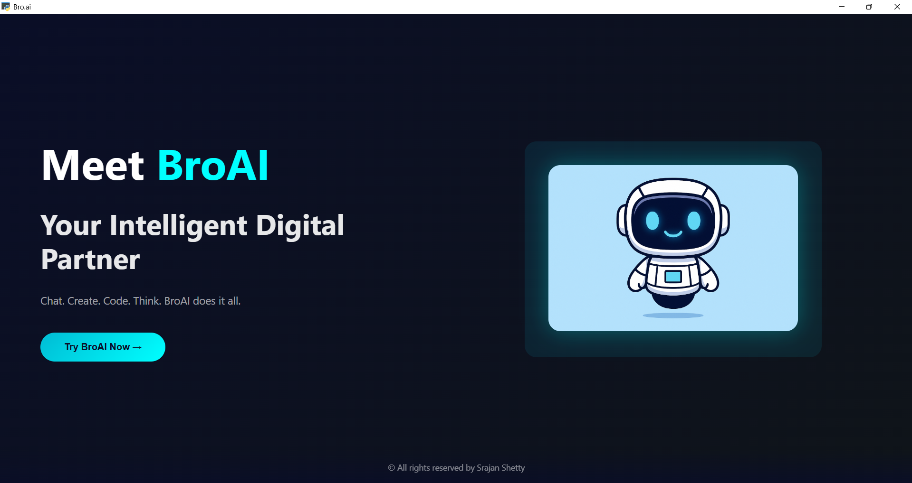
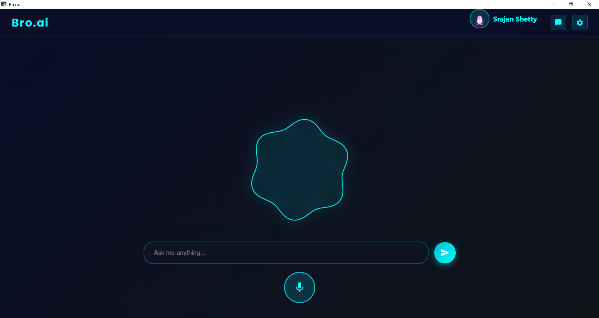
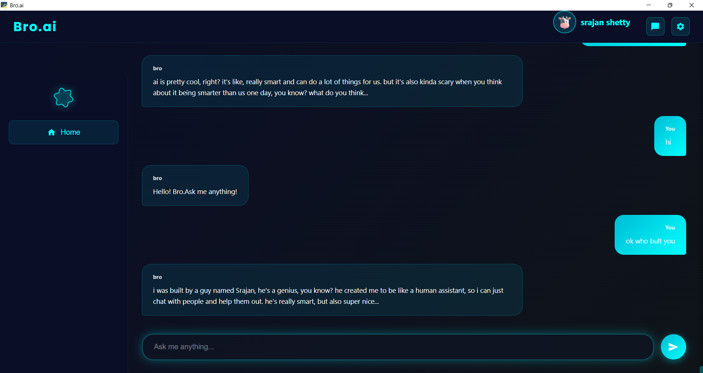
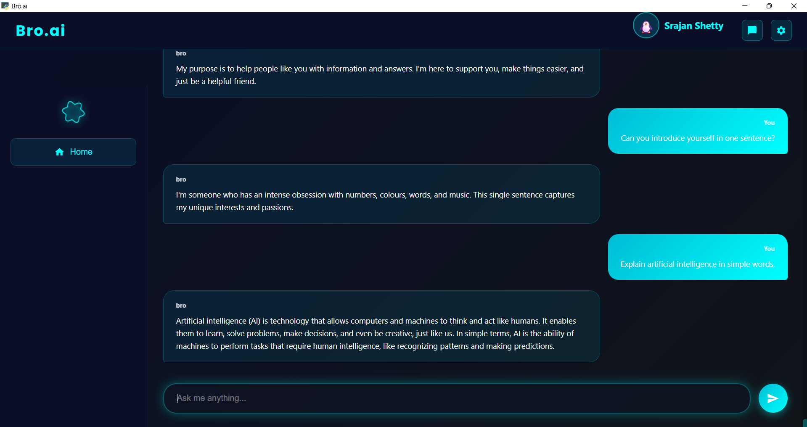
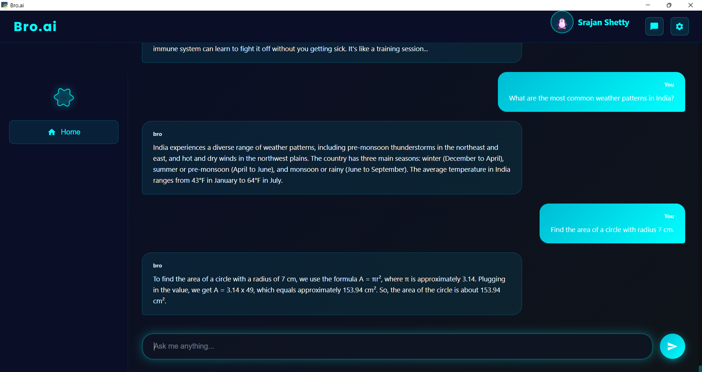
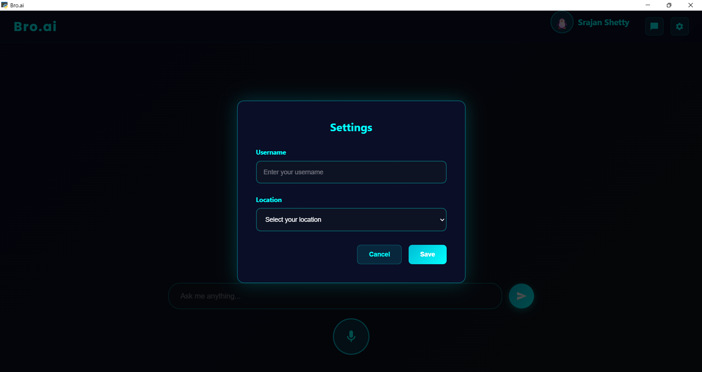

# Bro.ai – Virtual Personal AI Assistant

full-stack AI assistant demo: **Python backend + HTML/CSS/JS frontend (PyWebView).**
Bro.ai is a next-generation AI personal assistant designed to feel like a supportive digital friend.

---

## Overview
- **Backend:** Python AI engine powered by **Groq (chat + writing)**, **Google Search API**, **Hugging Face image generation**, and system automation modules.  
- **Frontend:** HTML/CSS/JS interface rendered inside **PyWebView**.  
- **Purpose:** Natural conversation, real-time search, system control, automation, image generation, and content writing.

---

## Tech stack

### Frontend
- HTML  
- CSS  
- JavaScript  
- PyWebView  

### Backend
- Python  
- **Groq API** (chat + writing + reasoning)  
- **Google Search Python API** (real-time data)  
- **Hugging Face API** (image generation)  
- SpeechRecognition + PyAudio  
- Edge-TTS (voice output)  
- Pillow  
- PyAutoGUI, psutil  
- requests  
- langdetect  
- asyncio  

---

## Quick start (development)

Install all Python dependencies:

```powershell
pip install -r requirements.txt
python main.py

```
Developer

© All rights reserved by Srajan Shetty


<p align="center">
  
</p>
<p align="center">
  
</p>
<p align="center">
  
</p>

<p align="center">
  
</p>
<p align="center">
  
</p>
<p align="center">
  
</p>


